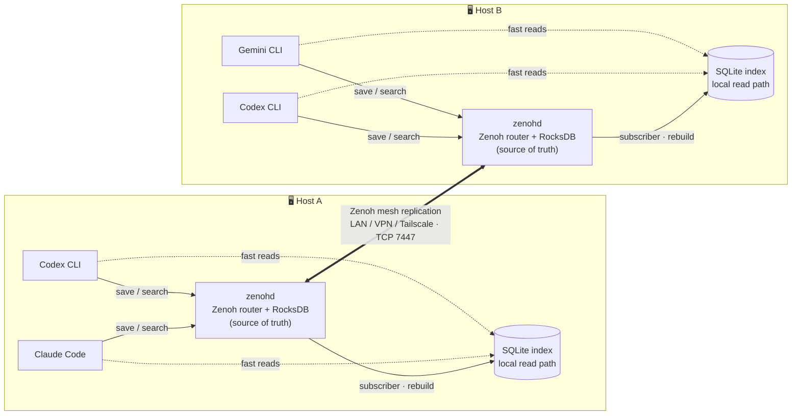
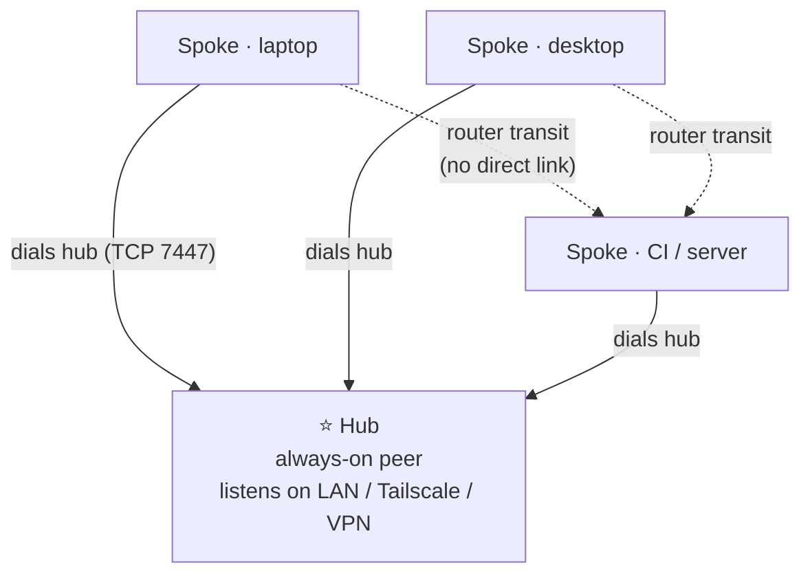

:::message
本記事は **kioku-mesh 連載 第1回** です。連載では、AI コーディングエージェントの記憶を複数のツール・複数のマシンで共有する OSS「kioku-mesh」を、手元1台で動かすところから、複数ホストでメッシュを組むところまで段階的に解説します。
:::

## 連載のゴール

Claude Code / Codex CLI / Gemini CLI など、複数の AI コーディングエージェントを使っていると、いつもこんなことが起きませんか。

- ノート PC で Claude Code と議論して決めた設計を、デスクトップの Codex CLI が知らない
- 同じプロジェクトなのに、エージェントごとに同じ説明を何度もやり直している
- 別マシンの「セカンドオピニオン用エージェント」に状況共有するだけで一仕事

[kioku-mesh](https://github.com/h-wata/kioku-mesh) はこの「エージェントの記憶が分散する問題」を、自前の peer-to-peer メッシュで解決する OSS です。`kioku`（記憶）の名のとおり、決定・バグ・発見・規約などをエージェント横断で1つのプールに溜め、どのマシンのどのエージェントからも検索できるようにします。

この連載では、次の流れで kioku-mesh を立ち上げていきます。

1. **第1回（本記事）**: kioku-mesh とは何か、なぜ必要か、全体像
2. **第2回**: 1台で動かして MCP クライアント（Claude Code / Codex CLI）から使う
3. **第3回**: メッシュの仕組み — Zenoh と SQLite index の役割
4. **第4回**: hub を立てて spoke を繋ぎ、複数ホストでメッシュを構築する
5. **第5回（任意）**: mTLS でピア間通信を締める

最終的には、複数の PC やサーバーをまたいでエージェントの記憶を共有できる状態を目指します。

## エージェントの context は、なぜ分断されるのか

最近の AI コーディングエージェントは、それぞれが独立した short-term memory を持っています。会話履歴、開いたファイル、決定事項、見つけたバグ — これらはエージェントのプロセスとセッションの中だけで生きていて、

- 別のセッションを開けば消える
- 別のツール（Claude Code → Codex CLI）に持ち越せない
- ましてや**別のマシン**には何も伝わらない

という状態がデフォルトです。各エージェントには「永続メモリ」を後付けする MCP server もいくつか存在しますが、多くはローカルファイル前提だったり、SaaS にデータを預ける前提だったりして、「自分の手元の複数マシン間で、自分のデータのまま共有する」という要件にはぴったりハマらないことが多いです。

## kioku-mesh の立ち位置

kioku-mesh は、その要件に対して次のスタンスを取ります。

- **自前 peer-to-peer メッシュ**: LAN / VPN / Tailscale 上に自分のピアだけで構成。SaaS なし、中央アカウントなし
- **MCP ネイティブ**: Claude Code、Codex CLI、Gemini CLI、その他 MCP クライアントから同じプールを読み書きできる
- **ローカルファースト**: まずは1台・SQLite だけで動く。必要になったらメッシュに昇格させる

README から引用すると、コンセプトはこの一文に集約されています。

> Shared memory for AI coding agents, across tools and machines.

「ツール横断」と「マシン横断」を同じ memory プールで成立させる、というのが kioku-mesh の主張です。

## アーキテクチャの全体像

メッシュモードで動かしたときの構造は、README の図がそのまま分かりやすいので引用します。

押さえておきたいのは次の3点です。

1. **source of truth は Zenoh + RocksDB**
   ホストごとに `zenohd` が動き、RocksDB に observation を保存します。ホスト間ではこの層が Zenoh のレプリケーションで同期します。
2. **読みは SQLite index**
   各ホストの SQLite は RocksDB から構築されるローカルな「読み専用インデックス」です。エージェントから見ると `search` がローカル SQLite で完結するため、速い。別途同期する「コピー」ではなく、いつでも捨てて作り直せるキャッシュという扱いです。
3. **エージェントは MCP 経由**
   各エージェントは MCP server (`kioku-mesh-mcp`) 経由で save/search します。エージェント側に Zenoh の知識は不要です。

なお1台だけで使う `local` モードでは Zenoh も RocksDB も使わず、SQLite 単体で完結します。この場合の保存はあくまでローカル止まりで、メッシュには載りません。

## モードの使い分け

kioku-mesh は実用上3つのモードを覚えれば十分です。「どのモードから始めるべきか」を最初に決めておくと迷いません。

| モード | 使い所 | 永続化 | 追加サービス |
| --- | --- | --- | --- |
| `local` | 1台で完結させたい | SQLite | なし |
| `hub` | このマシンを常時起動のメッシュハブにする | RocksDB | `zenohd` |
| `spoke` | hub に接続する側 | RocksDB | `zenohd` |

おすすめの始め方は **まず `local` で動かして、MCP 接続まで体験する** → **必要になったら `hub` + `spoke` に切り替える** という順番です。`init --mode <mode> --force` でいつでも切り替えられます。

連載では `local` → `hub` + `spoke` の流れで進めます。

:::message
このほかに Zenoh 自体の動作確認用として `localhost` モードもありますが、in-memory・1台限定で実運用フローには乗らないため、本連載では扱いません。
:::

## トポロジー：hub と spoke

メッシュを組むときの推奨トポロジーは「1つの hub + 任意個の spoke」です。

- hub は spoke から到達できるアドレスで listen する（LAN IP、Tailscale IP、VPN IP など）
- spoke は hub だけを dial する。spoke 同士は hub の router 経由で透過的に通信できる
- 「常時起動のサーバー or デスクトップ」を hub にし、ノート PC や CI を spoke にするのが現実的

## セキュリティの前提

kioku-mesh は **「閉じた、信頼できるネットワーク上で動かす」** ことを前提に設計されています。

- `7447/tcp` は信頼するピアの間でだけ到達可能にする
- インターネットや信頼できない LAN に晒さない
- デフォルトでは「ネットワーク到達できる＝信頼する」モデル（Tailscale / WireGuard / FW で絞る）

これで足りないケース、たとえば「Tailscale だけど ACL ミスのリスクを潰したい」「同居人がいる LAN で動かしたい」といった場合は、**mutual TLS** を有効化できます。各ピアは自分のプライベート CA が署名した証明書を提示し、未検証のリンクは `zenohd` が拒否します。秘密鍵はホストから出ず、やり取りするのは CSR と署名済み証明書だけ（どちらも非秘密）です。

mTLS は連載の第5回（任意回）で扱います。

## 次回予告

第2回では、`local` モードで `pip install` から `save` / `search` まで一通り走らせたあと、Claude Code と Codex CLI に MCP として組み込み、「片方のエージェントで保存 → もう片方で検索」を体験します。1台で完結する範囲なので、外部ネットワークの準備は不要です。

それでは次回、手を動かすところから始めましょう。

## 参考リンク

- [kioku-mesh (GitHub)](https://github.com/h-wata/kioku-mesh)
- [PyPI: kioku-mesh](https://pypi.org/project/kioku-mesh/)
- 影響を受けたプロジェクト: [engram](https://github.com/Gentleman-Programming/engram) / [claude-mem](https://github.com/thedotmack/claude-mem)
