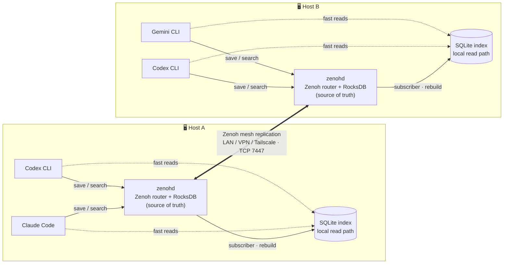

:::message
本記事は Claude（AI）の支援を受けて執筆しています。内容は著者がレビュー・編集したうえで公開しています。
:::

:::message
本記事は **kioku-mesh 連載 第1回** です。連載では、AI コーディングエージェントの記憶を複数のツール・複数のマシンで共有する OSS「kioku-mesh」を、手元1台で動かすところから、複数ホストでメッシュを組むところまで段階的に解説します。
:::

## kioku-mesh

[kioku-mesh](https://github.com/h-wata/kioku-mesh) は、複数台の PC・複数の AI エージェントをまたいで、AI セッションの長期記憶を共有しておくためのツールです。`kioku`（記憶）の名のとおり、エージェントが下した決定や直したバグ、プロジェクトの規約といった「あとで効いてくる文脈」を1つのプールに溜めておき、どの PC のどのエージェントからでも引き出せるようにします。

@[card](https://github.com/h-wata/kioku-mesh)

## なぜ作ったか

自分は普段、自宅 PC とオフィス PC を行き来しながら開発しています。片方の PC で進めた作業を、もう一方で続けようとすると、エージェントは前の文脈を何も覚えていません。毎回ゼロから会話をやり直すことになり、その立ち上がりの待ち時間がとにかく苦痛でした。

自分自身も「いつ・なぜその設計判断をしたか」を覚えきれません。チャット履歴を遡れば書いてはあるものの、検索性は弱く、別マシンや別ツールに移った瞬間に拾えなくなります。

地味に効いてくるのが、複数エージェントで「コーディング担当」と「レビュー担当」を分けて動かすときです。サブのエージェントが毎回フォルダ全体を読みに行き、現状把握が終わるまで本題に入れない。ここで何分も持っていかれます。

既存の長期記憶ツールも一通り見ました。ただ、SaaS にデータを預ける前提のものか、逆に1台に閉じる前提のものが多く、「複数台で、自分のデータのまま、LAN/VPN に閉じて共有したい」という要件にはどれも少しずつ噛み合いません。なら作るか、で始めたのが kioku-mesh です。

## どう解いたか

kioku-mesh の中身は、[Zenoh](https://zenoh.io/) ベースのメッシュです。Zenoh + RocksDB を source of truth に置き、その上に各ホストのローカルな SQLite 読みキャッシュを乗せています。

| 起きていた問題                             | kioku-mesh での解き方                                                                                                                                                |
| ------------------------------------------ | -------------------------------------------------------------------------------------------------------------------------------------------------------------------- |
| 自宅 PC ↔ オフィス PC で文脈が引き継げない | Zenoh メッシュで save/search を全 PC に同期。新しい PC を1台 mesh に追加するだけで、過去に他の PC で save した memory も全部読める                                   |
| いつどんな決定をしたか思い出せない         | 観測に `memory_type=decision` / `subject` / `importance` を付けて save。後から `search` で時系列・主題で引ける                                                       |
| サブエージェントが毎回フォルダを読み直す   | MCP server (`kioku-mesh-mcp`) 経由で `search_memory` / `save_observation` を共有プールに直結。前のエージェントが残した文脈をそのまま引けるので、最初から本題に入れる |

作るうえで外せなかったのは、自前の peer-to-peer メッシュであること、SaaS や中央アカウントに依存しないこと、そして MCP ネイティブであること。いずれも、手元の信頼できるネットワーク（LAN / VPN / Tailscale）の中だけで閉じておきたい、という一点から来ています。

## アーキテクチャの全体像

メッシュモードで動かしたときの構造はこんな形です。



図は上から下へレイヤーで追うと読めます。

1. source of truth は Zenoh + RocksDB。ホストごとに `zenohd` が動いて RocksDB に observation を保存し、ホスト間はこの層が Zenoh のレプリケーションで同期する。
2. 読みは SQLite index。各ホストの SQLite は RocksDB から構築されるローカルな読み専用インデックスで、`search` はここで完結する。同期で揃えるコピーではなく、いつでも捨てて作り直せるキャッシュという位置づけ。
3. エージェントからは MCP 経由。`kioku-mesh-mcp` 越しに save/search するだけで、エージェント側に Zenoh の知識は要りません。

なお1台だけで使う `local` モードでは Zenoh も RocksDB も使わず、SQLite 単体で完結します。この場合の保存はあくまでローカル止まりで、メッシュには載りません。

## モードの使い分け

実運用で触るモードは、次の `local` / `hub` / `spoke` だけ押さえておけば足ります。

| モード  | 使い所                                   | 永続化  | 追加サービス |
| ------- | ---------------------------------------- | ------- | ------------ |
| `local` | 1台で完結させたい                        | SQLite  | なし         |
| `hub`   | このマシンを常時起動のメッシュハブにする | RocksDB | `zenohd`     |
| `spoke` | hub に接続する側                         | RocksDB | `zenohd`     |

まずは `local` で動かして MCP 接続まで一度体験し、複数台で使いたくなったら `hub` + `spoke` へ切り替える、という順で試すのが楽だと思います。切り替えは `init --mode <mode> --force` でいつでもできます。

:::message
このほかに Zenoh 自体の動作確認用として `localhost` モードもありますが、in-memory・1台限定で実運用フローには乗らないため、本連載では扱いません。
:::

## まずは触ってみる

`uv tool install` で2つのコマンド（`kioku-mesh` と `kioku-mesh-mcp`）が入ります。

```bash
uv tool install kioku-mesh
kioku-mesh init --mode local
kioku-mesh save "Today lunch is Onigiri"
kioku-mesh search "Onigiri"
kioku-mesh mcp install --client claude-code
```

`mcp install` の後は、エージェント側からは `save_observation` / `search_memory` が普通の MCP tool として呼べるようになります。Codex CLI など他クライアントも同じ形で繋げます。

詳しいコマンド・引数の使い方と、MCP からの動作確認は第2回でやります。

## 制約とセキュリティの前提

メッシュを公開する前に、現状の制約をはっきりさせておきます。

- バージョンはまだ `0.x` で実験的です。今後破壊的な変更があり得ます。
- 開発は Linux 中心です。macOS / Windows は十分な検証ができていません（Windows は WSL2 推奨）。
- **信頼できるネットワーク上で動かす前提**の設計です。インターネットに公開してしまうと `7447/tcp` 経由で Zenoh の key-value が外から見える状態になります。LAN / VPN / Tailscale など閉域網での利用を強く推奨します。

それでも足りないケース（Tailscale ACL のミス対策、同居人がいる LAN で動かしたい等）に向けて、ピア間 mTLS を有効化する手段も用意しています。詳細は連載第5回で扱います。

## 連載で扱うこと

1. **第1回（本記事）**: kioku-mesh を作った動機、全体像、最初の触り方
2. **第2回**: `local` モードで一通り動かし、Claude Code / Codex CLI に MCP として組み込む
3. **第3回**: メッシュの中身（Zenoh + RocksDB + SQLite index）の役割整理
4. **第4回**: hub と spoke を立てて複数ホストでメッシュを組む
5. **第5回（任意）**: mTLS でピア間通信を締める

複数 PC・複数エージェント間でエージェントの記憶を共有できる状態をゴールにします。

## リンク

- PyPI: <https://pypi.org/project/kioku-mesh/>
- GitHub: <https://github.com/h-wata/kioku-mesh>
- Demo: <https://github.com/h-wata/kioku-mesh/blob/main/docs/assets/demo.gif>
- 影響を受けたプロジェクト: [engram](https://github.com/Gentleman-Programming/engram) / [claude-mem](https://github.com/thedotmack/claude-mem)
