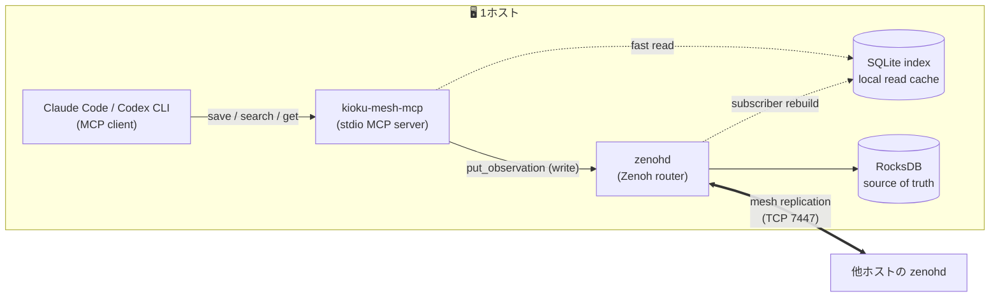
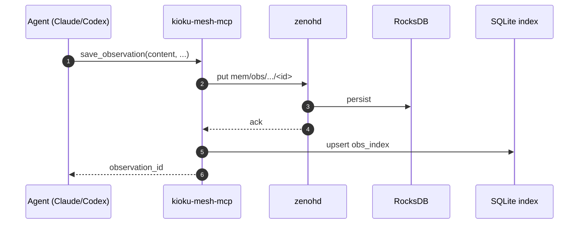

:::message
本記事は Claude（AI）の支援を受けて執筆しています。内容は著者がレビュー・編集したうえで公開しています。
:::

:::message
本記事は **kioku-mesh 連載 第3回** です。前回は `local` モードを1台で動かし、Claude Code / Codex CLI に MCP として組み込みました。今回はメッシュモードの中身、特に「source of truth はどこか」「なぜ SQLite が別にいるのか」を整理します。次回（第4回）で hub/spoke を実際に立てるための土台になる回です。
:::

@[card](https://github.com/h-wata/kioku-mesh)

## 今回のスコープ

連載第4回でメッシュを組むとき、何も知らずに `init --mode hub` から始めても動きはしますが、トラブルシュート時に「いま壊れているのはどの層？」が判断できません。今回はそこをはっきりさせます。

扱うのはこのあたりです。

1. Zenoh + RocksDB が source of truth、SQLite は読みキャッシュ
2. 書き込みは Zenoh → SQLite の順に流れる
3. `local` から `hub/spoke` に切り替えると、SQLite の置き場所が変わる

## 全体像をもう一度



エージェントから見ると、書きと読みの経路が違っています。

- 書き: エージェント → `kioku-mesh-mcp` → `zenohd` → RocksDB
- 読み: エージェント → `kioku-mesh-mcp` → ローカル SQLite

この非対称さは狙ってそうしていて、以下がその理由です。

## なぜ Zenoh + RocksDB が source of truth なのか

メッシュの本質は「複数ホスト間で同じ observation を見えるようにする」ことです。これを成立させる層は、

- 複数ノード間で publish / subscribe / replication ができる
- ストレージ backend に永続化できる

を両方備えている必要があります。kioku-mesh はこれを Zenoh + Zenoh Storage Backend (RocksDB) で実現しています。

Zenoh は key-value 形式の分散 pub/sub で、key は階層パスです。kioku-mesh は observation に次のような key を割り当てます（`docs/Spec.md` §3）。

```text
mem/obs/{agent_family}/{client_id}/{pc_id}/{session_id}/{observation_id}
mem/tomb/{agent_family}/{client_id}/{pc_id}/{session_id}/{observation_id}
```

- `mem/obs/...` が observation 本体
- `mem/tomb/...` は同じパス構造の tombstone（論理削除マーカー）
- 検索時の identity フィルタ（`agent_family` / `client_id` / `pc_id` / `session_id`）は、そのままこのパス階層への絞り込みになる

そして `zenoh-backend-rocksdb` が `mem/obs/**` と `mem/tomb/**` を RocksDB に永続化します。クラスタ全体で正なのは RocksDB 上の値で、各ホストの SQLite はそこから作り直せる二次資料、という関係です。あるホストの SQLite が壊れても、RocksDB さえあれば復旧できます。

## なぜ SQLite が別にいるのか

「source of truth が RocksDB なら、検索もそこに直接かければよいのでは？」と思うところですが、kioku-mesh はあえて分けています。理由は次の2点です。

### 1. 検索クエリが SQL 向きだから

エージェントが使う `search` は、

- 全文っぽい部分一致
- `memory_type` / `importance` / `subject` / `project` / `created_at` での絞り込み
- 件数制限と新しい順ソート

といった「典型的な SQL クエリ」です。これは RocksDB の key-value インターフェースに直接乗せるより、SQLite で素直に書ける形をしています。

SQLite 側のスキーマも、`obs_index` テーブルに `observation_id` / `project` / `created_at` / `memory_type` / `importance` / `subject` / `summary` / `payload_json` / `deleted_at` を持ち、`(project, created_at DESC)` と `(created_at DESC)` のインデックスを張っています（`docs/Spec.md` §6）。検索はここに来ます。

### 2. ローカルで完結する「速い読み」が欲しいから

エージェントの会話中に毎回 Zenoh に往復していたら、ローカル参照なのに不要な遅延が乗ります。書きの後追いで埋まる読みキャッシュとして SQLite を持つことで、write は Zenoh を必ず通す（メッシュに伝播させるため）、read は SQLite ローカルで完結（速い）の役割分担が成立します。SQLite を WAL モードで開き、`busy_timeout=5000` で扱う、256 upsert ごとに `wal_checkpoint(TRUNCATE)` する、といった運用上のチューニングも入っています。

## 書き込みは Zenoh → SQLite の順で流れる

`docs/Spec.md` §6 のフローを噛み砕くと、こうなります。

1. エージェントが `save_observation` を呼ぶ
2. `kioku-mesh-mcp` が Zenoh に `mem/obs/...` を `put`
3. Zenoh への put が成功してから SQLite に upsert
4. 別ピアからの書き込みは `start_index_subscriber` が `mem/obs/**` / `mem/tomb/**` を購読していて、SQLite に取り込む



順序が「Zenoh → SQLite」なのは、メッシュに伝播していない状態でローカルだけ嘘の検索結果を返さないためです。逆にいうと、SQLite に存在する観測は、必ず Zenoh 経由で見たことがある観測ということになります。

別 peer から飛んできた observation を取り込むのは subscriber で、これが起動中ずっと `mem/obs/**` を listen しています。だから「Host A の Claude Code が save」→「Host B の Codex CLI が search」が、Codex CLI 側で何も特別なことをしなくても通ります。

## 起動時の rebuild ポリシー

SQLite が読みキャッシュであるとはいえ、長時間プロセスを起動した瞬間に「mesh 上で増えた observation が見えていない」と困ります。そこで kioku-mesh は起動時に `rebuild_from_zenoh` を走らせるオプションを持っていて、短命プロセスは skip、長時間プロセスは実行という形で使い分けています（`docs/Spec.md` §7）。

| 起動形態 | 既定 |
| --- | --- |
| `kioku-mesh` CLI | rebuild を skip（one-shot 起動を速く） |
| `kioku-mesh-mcp` | rebuild を実行（起動時の一度だけコストを払う） |

優先順位は `--rebuild`（明示）→ `MESH_MEM_FORCE_REBUILD=1` → `MESH_MEM_SKIP_REBUILD=1` → 既定、です。「メッシュに対して `kioku-mesh search` を打ったら数件足りない気がする」というときは、`MESH_MEM_FORCE_REBUILD=1` で打ち直すと subscriber の取り逃しを取り戻せます。

## 削除と tombstone

`delete` がいきなり物理削除ではなく tombstone を書くだけなのも、メッシュを意識した設計です。

- ある peer が `delete` した → `mem/tomb/.../<id>` が put される
- 他 peer の subscriber がそれを拾って、自分の SQLite の `deleted_at` を埋める
- 物理削除は `gc --retention-days N` を回したときに、ある程度時間が経過した tombstone を対象に行う

「片方で消したつもりがもう片方で蘇る」が起きないよう、削除も Zenoh 上の正規イベントとして流しています。

## `local` と `hub/spoke` で SQLite の置き場所が変わる

ここまでが Zenoh ベースの `hub/spoke` モードの話で、`local` モードはこれを単純化したものです。

`docs/Spec.md` §6 にあるとおり、SQLite の置き場所はモードで分かれています。

- Zenoh backend (`hub` / `spoke`): `MESH_MEM_INDEX_DB` があればそのパス、なければ `state_dir()/index.db`。`:memory:` 指定も可。
- Local backend (`local`): `state_dir()/local/index.db` で固定。`MESH_MEM_INDEX_DB` は影響しない。

つまり `init --mode local --force` でローカル運用していた SQLite と、`init --mode hub --force` でメッシュに切り替えた後の SQLite は別ファイルです。「`local` で貯めたメモを `hub` に切り替えたら見えなくなった」と感じるのはこのためで、ファイルが行方不明になったわけではありません。マイグレーションの手段はあるので、必要なときに別途取り上げます。

## トラブル時にどの層を疑うか

メッシュ運用に入ると問題が起きうる箇所が分散します。今回の分解を覚えておくと切り分けが速くなります。

- 保存したのにメッシュの別 peer から見えない → Zenoh のレプリケーション（`zenohd` 同士が繋がっているか、TCP 7447 が通っているか）
- 自ホストでも save 直後の search に出ない → SQLite の upsert か subscriber の購読
- mesh 上に存在するはずの観測が一覧に出ない → 起動時 rebuild の skip（`MESH_MEM_FORCE_REBUILD=1`）
- delete しても消えた感じがしない → tombstone が伝播していない、または `gc` をまだ回していない

`kioku-mesh doctor` はこれら境界をまとめてチェックしてくれるので、まず叩くのは `doctor` です。

## 次回予告

第4回ではいよいよ実機で、

- `init --mode hub` で hub を1台立てる
- `--listen` でアドレスを設計する
- `init --mode spoke --connect` で spoke を繋ぐ
- 双方向 replication を `save` / `search` で確認する

ところまでやります。今回の「source of truth は Zenoh+RocksDB、読みは SQLite」を頭に入れておくと、手順の意味を取りやすくなります。

## 参考リンク

- [kioku-mesh (GitHub)](https://github.com/h-wata/kioku-mesh)
- リポジトリ内: `docs/Spec.md`（§3 Zenoh key 設計 / §6 SQLite インデックス / §7 rebuild ポリシー）
- 連載第1回: [kioku-mesh とは](https://zenn.dev/h_wata/articles/kioku-mesh-01-intro)
- 連載第2回: [kioku-mesh を Claude Code と Codex CLI に MCP として繋ぐ](https://zenn.dev/h_wata/articles/kioku-mesh-02-local-mcp)
