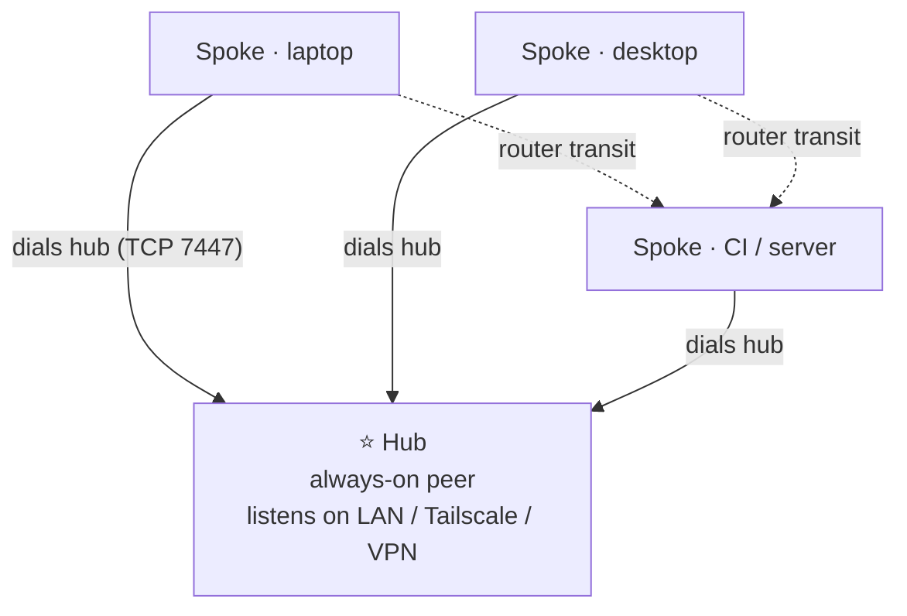

:::message
本記事は Claude（AI）の支援を受けて執筆しています。内容は著者がレビュー・編集したうえで公開しています。
:::

:::message
本記事は **kioku-mesh 連載 第4回** です。前回までで kioku-mesh の中身（Zenoh + RocksDB + SQLite index）を整理しました。今回は実機で hub を1台立て、spoke を繋いで、「Host A で保存 → Host B で検索」を成立させます。連載のゴールにあたる回です。
:::

## ゴール

- 1台を hub に仕立てる（`init --mode hub`）
- 1台以上の spoke を hub に繋ぐ（`init --mode spoke --connect <hub>`）
- `zenohd` を起動して、`save` / `search` で双方向 replication を確認する
- `--install-systemd` で常駐させる（Linux）
- 3〜5台への素直なスケール手順

## 前提

- ピア間で TCP 7447 が疎通する閉じたネットワーク（LAN / Tailscale / WireGuard / VPN いずれか）
- 各ホストに `uv tool install kioku-mesh` 済み（連載第2回参照）
- 各ホストに `zenohd` と `zenoh-backend-rocksdb` が PATH 上にあること
  - 現在のターゲットは Zenoh 1.9.0
  - パッケージ導入は [Zenoh の公式 install](https://zenoh.io/docs/getting-started/installation/) 参照。Debian/Ubuntu 系なら apt repository が早い
- Linux で `--install-systemd` を使う場合は user-scope systemd が使えること

:::message alert
`7447/tcp` は信頼するピア間でのみ到達可能にしてください。インターネットや信頼できない LAN に晒すのは想定外の運用です。
:::

## トポロジー設計

第1回で出した hub-spoke の図を再掲します。



実例として、本記事では以下の3台構成を一貫して使います。読者の手元 PC に当てはめて読み替えてください。`example_5peer.md` の5台構成にスケールするときの読み替えも、表の一番下に書いておきます。

| ホスト名 | 役割 | LAN IP | 想定マシン |
| --- | --- | --- | --- |
| **desktop** | hub（常時起動） | `192.168.1.10` | 自宅デスクトップ |
| **laptop**  | spoke | `192.168.1.11` | 持ち運ぶノート PC |
| **agent-server** | spoke | `192.168.1.12` | エージェント常駐サーバー |

以降、コマンドブロックは「どのホストで実行するか」を冒頭に明示します。たとえば `# [on desktop / 192.168.1.10]` というコメント行で始まる塊は、そのホストの shell に入ってから打ってください。

:::message
5台に増やす場合は `laptop` / `agent-server` のテンプレートのまま、`192.168.1.13`（SBC）、`10.0.0.14`（Tailscale 経由のリモート）といった spoke を増やすだけです。既存ホスト側の設定は触りません。
:::

## Step 1: hub を立てる（desktop / 192.168.1.10）

hub は spoke からのインバウンドを受ける側です。desktop（`192.168.1.10`）にログインして、`init --mode hub` で `zenohd.json5` を生成します。

```bash
# [on desktop / 192.168.1.10]
kioku-mesh init --mode hub \
  --listen 127.0.0.1 \
  --listen 192.168.1.10 \
  --out ~/.config/kioku-mesh/zenohd_desktop.json5 \
  --force
```

- `--listen 192.168.1.10` が spoke から見て desktop を指すアドレス。LAN IP の他に Tailscale IP / VPN IP があれば `--listen` を繰り返して足す
- `--listen 127.0.0.1` も入れておくと、desktop 自身の CLI / MCP クライアントが TCP/loopback で接続できる
- `--out` を明示すると、ホスト名と設定ファイルの対応が一目で分かる
- `--force` は既存ファイル上書き許可

`init --mode hub` は `connect.endpoints: []` のまま、つまり外には dial しません。

### desktop で `zenohd` を起動する

```bash
# [on desktop / 192.168.1.10]
zenohd -c ~/.config/kioku-mesh/zenohd_desktop.json5
```

別ターミナル（同じ desktop 上）で動作確認します。

```bash
# [on desktop / 192.168.1.10]
kioku-mesh doctor
```

doctor は backend / Zenoh 到達性 / SQLite index などをまとめてチェックしてくれます。

### desktop に常駐させる（user-scope systemd）

desktop は常時起動の hub なので、ログイン時に自動起動させます。`--install-systemd` を `init` に渡しておくと、`~/.config/systemd/user/kioku-mesh-zenohd.service` に unit が書かれます。

```bash
# [on desktop / 192.168.1.10]
kioku-mesh init --mode hub \
  --listen 127.0.0.1 \
  --listen 192.168.1.10 \
  --out ~/.config/kioku-mesh/zenohd_desktop.json5 \
  --install-systemd \
  --force

systemctl --user daemon-reload
systemctl --user enable --now kioku-mesh-zenohd.service
systemctl --user status kioku-mesh-zenohd.service
```

## Step 2: spoke を繋ぐ（laptop / agent-server）

spoke 側は hub である desktop（`192.168.1.10`）だけを dial します。

### laptop（`192.168.1.11`）

```bash
# [on laptop / 192.168.1.11]
kioku-mesh init --mode spoke \
  --listen 127.0.0.1 \
  --listen 192.168.1.11 \
  --connect 192.168.1.10 \
  --out ~/.config/kioku-mesh/zenohd_laptop.json5 \
  --force

zenohd -c ~/.config/kioku-mesh/zenohd_laptop.json5
```

- `--listen 192.168.1.11` は laptop 自身の IP。同ホストの CLI/MCP 用に `127.0.0.1` も入れる
- `--connect 192.168.1.10` は hub である desktop の IP

### agent-server（`192.168.1.12`）

```bash
# [on agent-server / 192.168.1.12]
kioku-mesh init --mode spoke \
  --listen 127.0.0.1 \
  --listen 192.168.1.12 \
  --connect 192.168.1.10 \
  --out ~/.config/kioku-mesh/zenohd_agent-server.json5 \
  --force

zenohd -c ~/.config/kioku-mesh/zenohd_agent-server.json5
```

各 spoke でやることは「自分の IP を `--listen` に、hub の IP を `--connect` に」だけです。台数が増えてもテンプレートは同じです。

### spoke も systemd で常駐させる

spoke 側でも `--install-systemd` がそのまま使えます。常時起動の agent-server や、ログイン時に自動で立ち上げたい laptop には付けておくと楽です。

```bash
# [on agent-server / 192.168.1.12]
kioku-mesh init --mode spoke \
  --listen 127.0.0.1 \
  --listen 192.168.1.12 \
  --connect 192.168.1.10 \
  --out ~/.config/kioku-mesh/zenohd_agent-server.json5 \
  --install-systemd \
  --force

systemctl --user daemon-reload
systemctl --user enable --now kioku-mesh-zenohd.service
```

unit 名は hub と同じ `kioku-mesh-zenohd.service` です。1ホスト1 zenohd 前提の名前なので、複数 zenohd を同一ホストで動かすつもりがなければそのままで問題ありません。

:::message
spoke 同士は互いを `--listen` にも `--connect` にも書きません。たとえば agent-server から laptop に直接繋ぐ設定は不要で、spoke-to-spoke の通信は hub である desktop の router transit を透過的に通ります。新 spoke を増やすときに既存 spoke の設定を触らずに済むのは、この性質のおかげです。
:::

### Boot order は気にしなくていい

desktop（hub）と spoke の起動順はどちらが先でも問題ありません。spoke 側 `zenohd` は `--connect 192.168.1.10` に届くまでリトライし続けます。3〜5台規模で `mem/**` がまだ少ない状態のコールドスタートなら、おおよそ 30〜60 秒で収束します。

## Step 3: 双方向 replication を確認する

`local` モードでは1台に閉じていた共有メモリが、本当にホスト間で同期しているかをチェックします。

### desktop → laptop 方向

まず hub である desktop でエントリを保存します。

```bash
# [on desktop / 192.168.1.10]
kioku-mesh save "メッシュからこんにちは（desktop 発）" \
  --memory-type note \
  --subject mesh-test
```

laptop に移って検索します。

```bash
# [on laptop / 192.168.1.11]
kioku-mesh search "desktop 発"
```

desktop で書いたエントリが laptop で見えたら、replication は desktop → laptop 方向で通っています。

### laptop → desktop 方向

逆向きも確認します。

```bash
# [on laptop / 192.168.1.11]
kioku-mesh save "返事します（laptop 発）" \
  --memory-type note \
  --subject mesh-test
```

```bash
# [on desktop / 192.168.1.10]
kioku-mesh search "laptop 発"
```

両方向で見えればメッシュは生きています。3台目以降がいる場合、agent-server でも同じ `kioku-mesh search` を打って、両方のエントリが出てくることを確認してください（spoke-to-spoke が hub の router transit を通っている証明になります）。

```bash
# [on agent-server / 192.168.1.12]
kioku-mesh search "mesh-test"
```

### 出てこないときに見るところ

第3回でやった層分解がそのまま使えます。

| 症状 | まず見る |
| --- | --- |
| 自ホストですら save 直後の search に出ない | 同ホストの `zenohd` が起動しているか、SQLite の upsert |
| 別ホストから見えない | `zenohd` 同士のリンク（TCP 7447 が通っているか、`--connect` のアドレスが正しいか） |
| 一覧に古い分が足りない | 起動時 rebuild の skip → `MESH_MEM_FORCE_REBUILD=1 kioku-mesh search ...` |
| 削除が反映されない | tombstone の伝播 / `gc` の実行有無 |

迷ったらまず `kioku-mesh doctor` です。

## Step 4: MCP クライアントを繋ぐ

第2回で `mcp install` までは終わっているなら、何も追加で要りません。`mcp install` は backend を自動判別して、`hub` / `spoke` モードなら zenoh 経由になります。

ホストを跨いで動作確認するなら、

1. laptop（`192.168.1.11`）で Claude Code を開き、kioku-mesh に「設計を1つ保存」させる
2. desktop（`192.168.1.10`）で Codex CLI を開き、kioku-mesh から検索させる

この2ステップで、第1回の冒頭で言っていた「ノート PC で Claude Code と決めたことが、デスクトップの Codex CLI に通る」状態ができあがります。

## スケール：4台目、5台目を足す

スケールアウトは spoke を増やすだけです。たとえば SBC（`192.168.1.13`）と Tailscale 経由のリモートマシン（`10.0.0.14`）を追加するとします。

```bash
# [on sbc / 192.168.1.13]
kioku-mesh init --mode spoke \
  --listen 127.0.0.1 \
  --listen 192.168.1.13 \
  --connect 192.168.1.10 \
  --out ~/.config/kioku-mesh/zenohd_sbc.json5 \
  --force
zenohd -c ~/.config/kioku-mesh/zenohd_sbc.json5
```

```bash
# [on remote / 10.0.0.14, Tailscale 経由]
kioku-mesh init --mode spoke \
  --listen 127.0.0.1 \
  --listen 10.0.0.14 \
  --connect 192.168.1.10 \
  --out ~/.config/kioku-mesh/zenohd_remote.json5 \
  --force
zenohd -c ~/.config/kioku-mesh/zenohd_remote.json5
```

ポイントは、

- desktop（hub）の設定を触らない
- 既存 spoke（laptop / agent-server）の設定も触らない
- 新 spoke 側で「自分の IP を `--listen`、desktop の IP を `--connect`」を1回流すだけ

既存メッシュは 1 replication interval 以内で新 peer を認識します。hub-spoke の本質は「インバウンドを受ける箱を desktop 1つに絞ることで、新規参加と FW 設定のコストを spoke 側だけに閉じる」ことなので、台数が増えても運用感は変わりません。

## ここまでで連載のゴールは達成

- 1台で動かす → ツール横断（第2回）
- メッシュを組む → マシン横断（今回）

これで kioku-mesh の主たる価値は手元で再現できる状態になりました。

## 次回（任意・最終回）予告

第5回（任意）では、ここまでの構成に mTLS を被せて、ピア間通信を「ネットワーク到達できる＝信頼する」から「証明書を持っているピアだけ信頼する」に引き上げます。Tailscale ACL の事故対策や、同居人がいる LAN で動かす場合の安全策として有効です。`kioku-mesh tls init-ca` / `enroll` / `install` の流れと、SSH なし copy-paste でのプロビジョニングを扱います。

mTLS まで必要としない読者は、ここまでで連載は完結としても問題ありません。

## 参考リンク

- リポジトリ内: `config/peers/example_5peer.md`（5ピア実例）
- リポジトリ内: `docs/mtls.md`（次回の予習）
- [Zenoh 公式ドキュメント](https://zenoh.io/docs/)
- 連載第1回: [kioku-mesh とは](#)
- 連載第2回: [1台で動かして Claude Code / Codex CLI から使う](#)
- 連載第3回: [Zenoh と RocksDB と SQLite index の役割](#)
