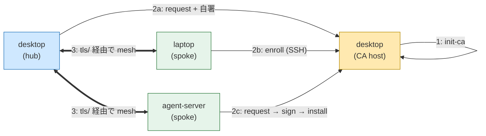

:::message
本記事は Claude（AI）の支援を受けて執筆しています。内容は著者がレビュー・編集したうえで公開しています。
:::

:::message
本記事は kioku-mesh 連載 第5回（最終回・任意）です。前回までで desktop（hub）+ laptop / agent-server（spoke）の3台メッシュを構築し、双方向 replication を確認しました。今回はその上に mTLS を被せ、「ネットワーク到達できる＝信頼する」モデルから「証明書を持つピアだけ信頼する」モデルに引き上げます。Tailscale ACL のミス耐性や、信頼できない LAN で動かすケースの保険として有効です。
:::

## なぜ mTLS を足すのか

kioku-mesh のデフォルトは network admission に依存する設計です。閉じた LAN・Tailscale・WireGuard などで `7447/tcp` を絞ることが前提で、それで多くの個人メッシュは十分です。

ただし次のような状況では、ネットワーク層の信頼だけでは足りません。

- Tailscale ACL の設定ミスで、本来繋いではいけないノードが届くようになっていた
- 同居人や同僚と LAN を共有している
- VPN を解約・更新したタイミングで一時的に admission が緩む

mTLS を入れると、`zenohd` は自分の private CA が署名した証明書を持っていないピアを全部拒否します。ネットワークが届いても、証明書がなければメッシュには参加できません。

設計のポイントは次の3つです。

- CA は自分で立てる（SaaS や Let's Encrypt は使わない、完全自前）
- 秘密鍵はホストから出ない（やり取りするのは CSR と署名済み証明書だけで、どちらも非秘密）
- ループバックは平文のまま（同ホスト上の CLI / MCP クライアントは `127.0.0.1` で TCP のまま繋ぐ）

## 構成

連載第4回の3台構成をそのまま使います。

| ホスト名 | 役割 | LAN IP | mTLS 上の役割 |
| --- | --- | --- | --- |
| desktop | hub | `192.168.1.10` | CA ホストを兼ねる |
| laptop | spoke | `192.168.1.11` | エンドエンティティ |
| agent-server | spoke | `192.168.1.12` | エンドエンティティ |

CA は別ホストに切り出してもいいですが、個人メッシュなら常時起動の hub に同居させるのが現実的です。本記事は desktop を CA ホスト兼 hub として進めます。

## ざっくりした流れ



1. CA ホスト（desktop）で CA を作る
2. 各ホストで証明書を発行する（desktop 自身も含む）
3. `init --mode hub/spoke --tls` で `zenohd` 設定を mTLS 版に切り替える

## Step 1: CA を作る（desktop）

CA キーは desktop の中だけに置き、外には出しません。

```bash
# [on desktop / 192.168.1.10]
kioku-mesh tls init-ca
```

これで CA キーと CA 証明書が desktop に作られます。後段の `tls sign` がこの CA キーで peer 証明書に署名します。

## Step 2: 各ホストの証明書を用意する

ここで2つのフローがあります。

- A. SSH ありの flow: 各 spoke から desktop に SSH できるなら `enroll` 一発
- B. SSH なしの flow: `request` → `sign` → `install` を手で paste で運ぶ

どちらを選んでも、秘密鍵はそのホストから外に出ません（移動するのは CSR と署名済み証明書だけです）。

### desktop 自身（hub & CA ホスト）

CA ホストが自分自身に署名する形になります。

```bash
# [on desktop / 192.168.1.10]
kioku-mesh tls request --san 192.168.1.10 --san 127.0.0.1 -o /tmp/desktop.csr
kioku-mesh tls sign /tmp/desktop.csr -o /tmp/desktop.bundle
kioku-mesh tls install /tmp/desktop.bundle
```

- `--san` には他のピアが dial してくる宛先アドレスを全部入れる（LAN IP、Tailscale IP、必要なら `127.0.0.1`）
- `install` 後、desktop には CA 証明書と自分用の peer 証明書 + 秘密鍵が揃う

### laptop（SSH あり: `enroll` を使う）

laptop から desktop に SSH できる前提なら、これだけです。

```bash
# [on laptop / 192.168.1.11]
kioku-mesh tls enroll user@192.168.1.10 --san 192.168.1.11
```

`enroll` は内部で「CSR 生成 → SSH 越しに `tls sign` 実行 → 戻ってきた bundle を install」を一気にやります。完了後、laptop には CA 証明書と自分用の peer 証明書 + 秘密鍵が揃います。

ssh ポートや追加オプションは `--ssh-port` / `--ssh-opt`（複数可）で指定できます。

### agent-server（SSH なし: copy-paste flow）

SSH を使いたくない/使えないホストは、`request` で出力された CSR ブロックを desktop の `tls sign` に貼り、戻ってきた bundle を `tls install` に貼ります。

```bash
# [on agent-server / 192.168.1.12]
kioku-mesh tls request --san 192.168.1.12
```

出力された CSR ブロックを desktop に持っていきます（クリップボード、Slack DM、何でも構いません。CSR は非秘密です）。

```bash
# [on desktop / 192.168.1.10]
kioku-mesh tls sign
# プロンプトに従って CSR を貼る → 署名済み bundle が出力される
```

戻ってきた bundle を agent-server に持ち帰り、install します。

```bash
# [on agent-server / 192.168.1.12]
kioku-mesh tls install
# プロンプトに従って bundle を貼る
```

秘密鍵は agent-server から一歩も動いていない点に注目してください。コピペで動くのは CSR と署名済み証明書だけです。

### --san の選び方

SAN（Subject Alternative Name）は「このピアが他のピアから dial されるときのアドレス」を全部入れます。

- LAN IP は必須（例: `192.168.1.11`）
- Tailscale や Wireguard でも届かせるならそのアドレスも入れる
- desktop（hub）は spoke 全員から dial されるので、特に SAN を網羅させる

ホスト名で繋ぐなら hostname も `--san` に追加できます。

## Step 3: `zenohd` 設定を mTLS 版に切り替える

ここまでで各ホストに証明書が揃ったら、`init` に `--tls` を足して再生成するだけです。第4回の `init` コマンドにフラグを1つ加える形になります。

### desktop（hub）

```bash
# [on desktop / 192.168.1.10]
kioku-mesh init --mode hub \
  --listen 127.0.0.1 \
  --listen 192.168.1.10 \
  --tls \
  --out ~/.config/kioku-mesh/zenohd_desktop.json5 \
  --force
```

`--tls` を付けると、

- クロスホストの endpoint が `tcp/...` から `tls/...` に切り替わる
- `transport.link.tls` ブロックが書かれ、ローカルの証明書ストアを参照する
- `enable_mtls: true` になり、対向ピアにも証明書提示を要求する
- ループバック（`127.0.0.1`）は `tcp/` のままで平文

ループバックを平文に残すのは意図的な設計です。同ホスト上の CLI / MCP クライアントは TCP/loopback で接続できれば十分で、ここに TLS を強制すると `kioku-mesh save` 一発のためにクライアントにも証明書を配る羽目になります。トラスト境界をホスト境界に揃える判断、と読み替えてください。

:::message
`--tls` のとき `127.0.0.1` を `--listen` に入れ忘れると、同ホストの CLI / MCP がメッシュに到達できなくなります。`init` 側もこのケースを warning で教えてくれます。
:::

### laptop / agent-server（spoke）

```bash
# [on laptop / 192.168.1.11]
kioku-mesh init --mode spoke \
  --listen 127.0.0.1 \
  --listen 192.168.1.11 \
  --connect 192.168.1.10 \
  --tls \
  --out ~/.config/kioku-mesh/zenohd_laptop.json5 \
  --force
```

```bash
# [on agent-server / 192.168.1.12]
kioku-mesh init --mode spoke \
  --listen 127.0.0.1 \
  --listen 192.168.1.12 \
  --connect 192.168.1.10 \
  --tls \
  --out ~/.config/kioku-mesh/zenohd_agent-server.json5 \
  --force
```

`--connect 192.168.1.10` はそのままで OK です。`init --tls` がクロスホストの endpoint だけを `tls/192.168.1.10:7447` 相当に書き換えてくれます（ループバックは `tcp/` のまま）。

### `zenohd` を再起動する

各ホストで `zenohd` を再起動して新しい設定を読み込みます。

```bash
# [on each host]
systemctl --user restart kioku-mesh-zenohd.service   # systemd 常駐の場合
# あるいは手起動なら zenohd プロセスを kill して再起動
```

## 動作確認

第4回と同じ `save` / `search` 往復をもう一度やります。

```bash
# [on desktop / 192.168.1.10]
kioku-mesh save "mTLS 越しのテスト（desktop 発）" --memory-type note --subject mtls-test
```

```bash
# [on laptop / 192.168.1.11]
kioku-mesh search "desktop 発"
```

通れば mTLS メッシュは生きています。逆向きも確認しておきましょう。

```bash
# [on laptop / 192.168.1.11]
kioku-mesh save "返事（laptop 発）" --memory-type note --subject mtls-test

# [on desktop / 192.168.1.10]
kioku-mesh search "laptop 発"
```

`doctor` も mTLS を意識した出力になります。

```bash
kioku-mesh doctor
```

証明書の有効期限や CA / peer cert の中身を見たいときは:

```bash
kioku-mesh tls info
```

## 失敗パターンの直し方

| 症状 | 原因と対処 |
| --- | --- |
| spoke から hub に繋がらない | hub の peer 証明書 SAN に、spoke が dial するアドレスが入っていない → desktop で `tls request --san 192.168.1.10 --san <他のアドレス>` から `install` まで打ち直し |
| 同ホストの CLI から繋がらない | `--tls` で `127.0.0.1` を `--listen` に入れ忘れ → `init --tls --listen 127.0.0.1 ...` で再生成 |
| 不要な UDP endpoint がある | mTLS は TCP に乗る → UDP の listen / connect は外すか、`tcp/` のままで運用 |
| 証明書期限切れ | `kioku-mesh tls info` で期限確認 → `enroll`（SSH あり）か `request`/`sign`/`install`（copy-paste）で再発行 |

## 証明書ローテーション

期限は `tls init-ca` 時にデフォルトが入ります。期限が近づいたら、各ピアで `enroll` か copy-paste flow を再実行するだけで、

- 古い証明書ファイルは新しいものに置き換わる
- `zenohd` を再起動すれば新しい証明書で繋がる

CA を作り直したい場合は `tls init-ca` をやり直し、各ピアで再 enroll します（CA が変わるので全ピアの再発行が必要）。

詳細な運用やトラストモデルの議論は、リポジトリ内の [`docs/mtls.md`](https://github.com/h-wata/kioku-mesh/blob/main/docs/mtls.md) を参照してください。

## 連載のしめくくり

ここまでで kioku-mesh の主要な要素を一通り扱いました。

- 第1回: コンセプトとアーキテクチャ
- 第2回: `local` モードと MCP クライアント連携（ツール横断）
- 第3回: Zenoh + RocksDB + SQLite index の役割
- 第4回: hub と spoke でメッシュを組む（マシン横断）
- 第5回（本記事）: mTLS で締める

「自前 peer-to-peer」「ローカルファースト」「MCP ネイティブ」というコンセプトを、手元の数台でそのまま再現できる状態に到達できたはずです。あとは普段の開発に kioku-mesh を混ぜていくだけで、エージェント間・マシン間で記憶がどんどん再利用されていきます。

実運用で見えてきた tips、ADR、運用上の落とし穴などはリポジトリ側に積んでいきますので、`docs/Spec.md` と `docs/adr/` も時々のぞいてみてください。

## 参考リンク

- リポジトリ内: `docs/mtls.md`（トラストモデル / 詳細手順 / ローテーション）
- リポジトリ内: `config/peers/example_5peer.md`（5ピア構成、`--tls` への切り替え記述あり）
- [Zenoh 公式: TLS / mTLS](https://zenoh.io/docs/manual/tls/)
- 連載第1回: [kioku-mesh とは](#)
- 連載第2回: [1台で動かして Claude Code / Codex CLI から使う](#)
- 連載第3回: [Zenoh と RocksDB と SQLite index の役割](#)
- 連載第4回: [hub を立てて spoke を繋ぎ、マシン横断の共有メモリを作る](#)
