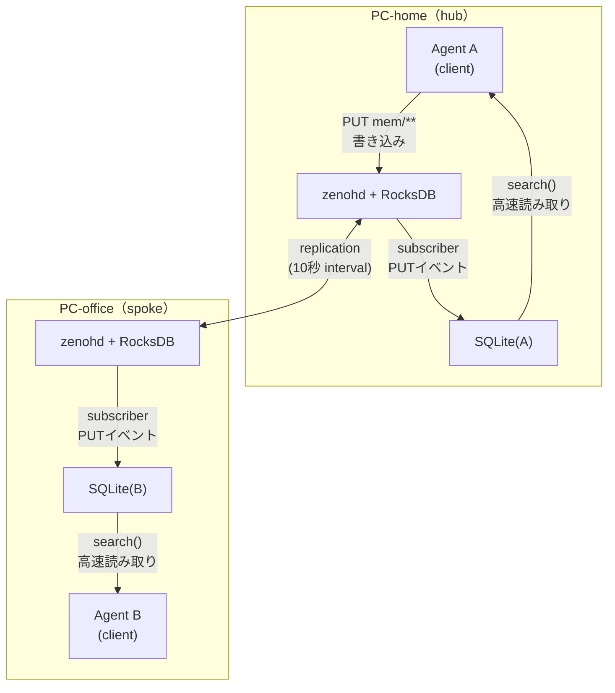

---

title: "kioku-mesh #7 - なぜ AI の長期記憶に Zenoh を使うのか"
emoji: "🔗"
type: "tech"
topics: \["mcp", "claudecode", "zenoh", "kiokumesh", "ai"]
published: true

---

:::message
本記事は Claude（AI）の支援を受けて執筆しています。内容は著者がレビュー・編集したうえで公開しています。
:::

## Claude Code と Web アプリのギャップ

Claude Code からしばらく使い込んで、Webアプリ版の生成AIを使うと、そのギャップに驚く方も多いと思います。Webアプリ版だと一から説明しないといけないことが多く、同じモデルを本当に使っているか疑いたくなります。ご存知の方も多いと思いますが、これはコンテキストの差にあります。

Claude Code はセッションをまたいで記憶を保持できます。しかしそれも **1台の PC 上** の話です。home のマシンで積み上げたコンテキストが、office のマシンでは白紙になる。複数の Agent が同時に動いていれば、それぞれが別々に「学習」していく。

この問題を解決しようとしたとき、最初に思いつくのは SQLite にメモを書く仕組みです。実際、多くの MCP memory app はそれで完結しています。

**ではなぜ kioku-mesh はその上に Zenoh という分散メッセージングシステムを載せたのか。**

## SQLite だけでは足りない理由

SQLite は1プロセス・1ファイルに縛られます。複数の PC にまたがった Agent が同じ記憶を読み書きするには根本的に向いていません。

たとえば素朴な解決策として「SQLite ファイルを rsync でコピーする」方法が考えられます。しかしこれには問題があります。

- **衝突**: home と office が同時に書き込んだ場合、どちらが「正」か判断できない
- **一貫性**: コピーのタイミングによって、片方が古い状態のまま動く
- **オフライン**: ネットワークが切れたら同期できず、再接続時に衝突が積み上がる

複数 PC・複数 Agent が同時に「書く」システムで SQLite ファイルのコピーを使うと、衝突解決のロジックを自前で実装しなければなりません。

## Zenoh を選んだ理由

kioku-mesh が Zenoh を採用したのは、この衝突問題を自前で解かなくて済むからです。

**Zenoh とは**

Zenoh（ゼノー）は Eclipse Foundation が開発する OSSの分散通信ミドルウェアです。もともと IoT やロボティクス向けに設計されており、クラウドサービスに依存せず自前のマシンだけで動かせる点が特徴です。pub/sub + KV（Key-Value）ストアの機能を持ちます。KV ストアとは「キー（名前）と値のペアを読み書きする」シンプルなデータベースの一種で、Redis や DynamoDB が有名です。Zenoh はそこにネットワーク越しの pub/sub とレプリケーションを組み合わせています。

**HLC（Hybrid Logical Clock）タイムスタンプ**

HLC は「物理クロック（実時刻）と論理クロック（因果順序）を組み合わせたタイムスタンプ」で、分散システムの研究から生まれた汎用的な概念です。CockroachDB など他のシステムでも採用されています。

通常の実時刻だけだと、PC ごとに時計のズレ（NTP ズレ）があるため「どちらが後に書いたか」が判断できなくなる場合があります。HLC はこのズレを吸収しつつ、「A の後に B が起きた」という因果関係を正しく記録します。

Zenoh の強みは **HLC が標準装備** されている点です。自前で実装しなくても、書き込み時に自動でタイムスタンプが付与されます。実測で NTP ズレが 12 秒を超えても因果関係が崩れなかったため、衝突解決に追加ロジックが不要です。

**replication plugin の digest 比較**

常時接続中の定期同期コストを low に保つために、hot/warm/cold era という粒度で digest を比較します。設定では `interval: 10.0`（秒）で定期的に差分を確認し、不一致があれば伝播します。split-brain 復旧後の再同期は約 5 秒で収束します。

**eventually-consistent な KV**

書き込みは即座に全ノードへ届く必要はありません。ネットワークが不安定でも、つながったタイミングで自動的に同期されます。これがオフライン耐性の根拠です。

## アーキテクチャ：全体像



### 書き込みパス

Agent が `save_observation` を呼ぶと、次の流れで処理されます。

1. `store.put_observation()` が Zenoh に `PUT mem/obs/...` を発行
2. zenohd の storage_manager が RocksDB に永続化
3. replication plugin が他ノードの zenohd に伝播
4. 成功後、呼び出し元プロセスの SQLite にも即時 upsert（同期）

### 読み取りパス

検索は **ローカルの SQLite** から返します。Zenoh には問い合わせません。

```python
# store.search_observations() の実装（概略）
def search_observations(query, ...):
    idx = get_index()
    if not idx.disabled:
        return idx.search(...)          # SQLite から返す
    return _search_via_zenoh(...)       # fallback: Zenoh 全スキャン
```

### SQLite の鮮度保証

SQLite はどうやって最新の状態を保つのか。2つのメカニズムがあります。

**① Zenoh subscriber（リアルタイム）**

プロセス起動時に `mem/obs/**` と `mem/tomb/**` をサブスクライブします。他ノードから replication で届いた PUT イベントを受信するたびに、SQLite を即時 upsert します。

```python
def on_obs(sample):
    obs = Observation.from_json(sample.payload.to_string())
    idx.upsert(obs)  # SQLite に即時反映

sub_obs = session.declare_subscriber('mem/obs/**', on_obs)
```

**② 起動時 rebuild（整合性保証）**

長期稼働プロセス（MCP サーバー）は起動時に1回だけ `rebuild_from_zenoh()` を実行し、Zenoh の `mem/obs/**` を全スキャンして SQLite を再構築します。プロセスが止まっていた間の更新（他ノードからの replication など）を取り込むためです。

実測では 5万件 で約 **0.4 秒**。MCP サーバーの起動時に一度だけ発生するため、通常は気になりません。

## パフォーマンス

SQLite を採用した決め手は実測データです。
当初はZenohに対して全スキャンを実行していましたがそれだと取得に時間がかかっていたためSQLiteをキャッシュとして用いるようにしました。

### Zenoh 全スキャン（旧パス）

ネットワーク越しに全件取得してから Python でフィルタ

| 件数       | レイテンシ                                   |
| ---------- | -------------------------------------------- |
| 1万6千件   | **2.2 秒**（limit に関わらず走査件数が支配） |
| 36MB store | **タイムアウト**（10 秒制限に引っかかる）    |

### SQLite local index（現パス）

ローカルの SQLite に SQL クエリを投げるだけ

| 件数  | 操作           | レイテンシ          |
| ----- | -------------- | ------------------- |
| 5万件 | rebuild        | **~0.4 秒**         |
| 5万件 | query p99      | **~0.04 ms**        |
| 5万件 | Tier-4 実機    | **sub-200 ms** 確認 |
| 5万件 | ファイルサイズ | **~49 MB**          |

Zenoh 全スキャンと SQLite の差は約 **5 万倍**。36MB の store では Zenoh 経由の検索がタイムアウトするのに対し、SQLite は 50k 件でも 1ms 以下で返ります。

## まとめ

kioku-mesh がなぜZenoh を使うかというと「**複数の PC が同時に書いても壊れない仕組みの実現のため**」です。
SQLite は速くて手軽ですが、1台のマシンの中でしか使えません。
Zenoh を追加することで、複数 PC 間でデータを同期し、HLC の仕組みで書き込みの衝突を自動解決してくれます。
読み取りはSQLiteから行うことで速度を保ってくれています。
Zenoh は「書く・同期する」、SQLite は「速く読む」と役割を分けて分散型長期記憶を実現しています。

---

_kioku-mesh は OSS として公開しています。_

@[card](https://github.com/h-wata/kioku-mesh)
