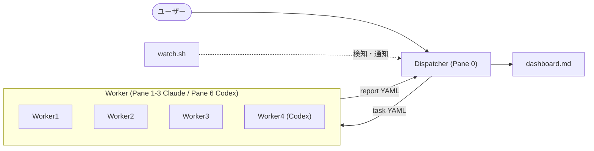
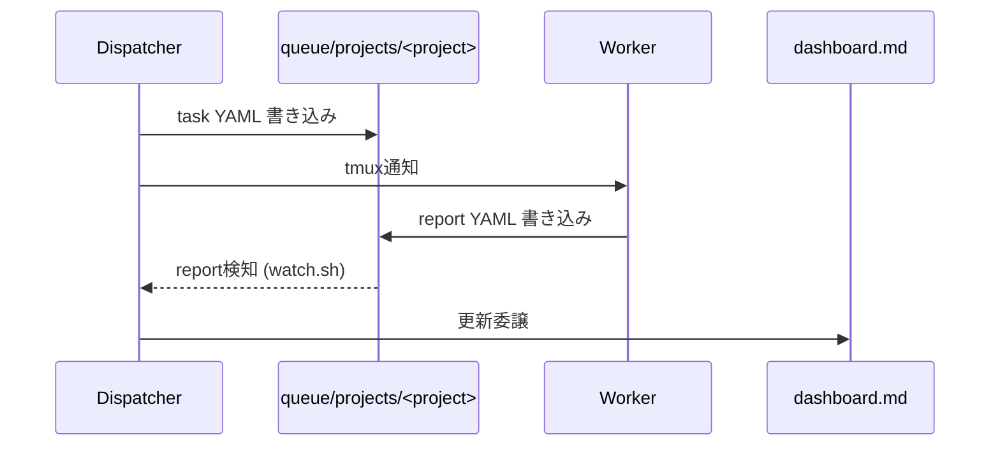

---

title: "tmux + Claude Code + Codex CLIでマルチエージェント開発チームを組んでみた"
emoji: "🤖"
type: "tech" # tech: 技術記事 / idea: アイデア
topics: ["claudecode", "AIエージェント", "tmux", "マルチエージェント"]
published: true

---

:::message
本記事は Claude（AI）の支援を受けて執筆しています。内容は著者がレビュー・編集したうえで公開しています。
:::

1つの Claude Code セッションに実装もレビューも全部やらせていた頃、いちばん困ったのはレビューだった。セッションが長くなると昔の設計判断はコンテキストから押し出されて消えるし、実装した本人がそのままレビュー役に回るので、同じ思い込みで同じ箇所を素通りする。他人にレビューさせたい。でも、その「他人」をどう用意するか。

最初は API で複数エージェントを繋ぐ構成を考えて、やめた。Claude Code と Codex CLI の SDK 差を吸収するレイヤーを自分で書いて保守する手間が、得られるものに見合わない。それより、すでに手元で動いている CLI をそのまま並べたほうが早い。tmux で pane を並べて、タスクの受け渡しはただの YAML ファイル。仕組みが単純だと、壊れたときに pane を一個 restart すれば元に戻る。凝った配管より、これを取った。

できあがったのが squad だ。tmux の上に管理役の Dispatcher を1体置き、その下に実作業をする Worker（Claude Code と Codex CLI）を並べる。エージェント同士は直接おしゃべりしない。やり取りは全部 YAML ファイル越しにやる。

@[card](https://github.com/h-wata/squad)

## pane構成

pane の並びはこれだけ。

```
Pane 0: Dispatcher (Claude)   タスク分配・進捗管理のみ担当
Pane 1-3: Worker 1-3 (Claude) 実装・調査
Pane 4: Terminal              汎用シェル
Pane 5: Aux-Shell              SSH等の汎用利用
Pane 6: Worker 4 (Codex)       設計相談・cross-review
```

俯瞰するとこうなる。



1本のタスクが流れるときの順番はこう。



## Dispatcherはコードを書かない

Dispatcher にやらせるのは1つだけ。来た指示を、どのプロジェクトの・どの Worker のタスクに落とすかを決めること。決めたら `queue/projects/<project>/tasks/worker{N}.yaml` を書いて tmux で通知する。あとは `reports/worker{N}_report.yaml` が返ってくるのを待ち、届いたら dashboard の更新はサブエージェントに投げる。この3手をぐるぐる回すだけ。

実装まで Dispatcher に持たせた時期もあったが、これがよくなかった。複数タスクを並行で捌いていると、コードの中身がコンテキストを食って、肝心の「誰にどこまで振ったか」を見失う。だから実装の詳細は一切乗せない。Dispatcher の頭の中は割り当て表だけにしておく。

タスクと報告はプロジェクトごとにディレクトリを分ける。

```
queue/projects/<project>/
  tasks/worker1.yaml
  tasks/worker4.yaml     # Codex 向け
  reports/worker1_report.yaml
  reports/worker4_report.yaml
```

分けている理由は事故防止に尽きる。混ぜておくと、別プロジェクトの report を Dispatcher が読み違えたり、Worker が作業ディレクトリと発注元の PJ を取り違えたりする。全体を見るときは index の `dashboard.md` から `dashboards/<project>.md` に降りていく。

## 実装はClaude、Codexは設計とレビューに温存

この配役には理由がある。Codex の利用枠は Claude より先に尽きる。手数のかかる実装を Codex に流すと、肝心なときに枠がなくて動けない。だから実装は基本 Claude（Worker 1-3）に寄せて、Codex（Worker 4）は設計の検討とレビューに温存する。Dispatcher が名指しすれば Codex に実装を振ることもあるが、それは例外で、迷ったら Claude、が既定値だ。

レビューの回し方にはもう一段こだわっている。PR は、書いた本人と逆の agent にレビューさせる。Claude が書いた PR は Codex に、Codex が書いた PR は Claude に回す。同じモデルに書かせてレビューまでさせると、冒頭の1セッション運用と同じ罠にはまる。同じ癖で同じ穴を見逃す。わざわざ別モデルの目を通すのはそのためだ。そして、この cross-review が通るまで PR は merge しない。CI が緑でも、だ。

## verify gate

「実装できました」という Worker の自己申告だけでは、テストが本当に通ったのかは分からない。放っておくと平気で「全部通りました」が返ってくる。

なので、`verify:` ブロックを持つタスクには、実装した Worker とは別に verifier サブエージェントを立てる。verifier が `verify.commands` を worktree で実際に走らせ、`acceptance_criteria` と突き合わせて pass / fail / inconclusive を返す。fail なら Worker が直してもう一度、を上限回数まで。それでも通らなければ blocked にして人間に投げる。completed を名乗れるのは、書いた本人ではなく別プロセスの検証を抜けた後だけ。要は自己採点を禁止しているだけなのだが、これがあるとないとでは報告の当てになり方がまるで違う。

## watch.sh

Claude Code の Worker には自動継続モードがない。これが地味に効く。確認待ちのプロンプトが1つ出ると、Worker はそこで黙って止まる。人間が張り付いていない限り、いつ止まったのか誰も気づかないまま時間だけが過ぎていく。

`watch.sh` はそのための常駐デーモンだ。report ファイルが現れたのを検知して Dispatcher に通知する。止まった Worker を見つけて知らせる。承認プロンプトには自動で応答する。ついでに Issue / PR / CI を低頻度で巡回し、merge 済みの worktree を片付け、こちらが後で拾いたい「気になったこと」を放り込む inbox も兼ねる。Dispatcher がルーティング判断に集中していられるのは、この地味な常駐が裏で全部拾ってくれているからだ。

## Dispatcherのコンテキストを節約する

task YAML を書くのも dashboard の表を直すのも、中身は定型なのに行数だけはかさむ。これを Dispatcher 本体にやらせると、ルーティング判断のために空けておきたいコンテキストが、その文字数で埋まる。もったいない。

なので切り出した。ルーティングが決まった後の task YAML 執筆は task-yaml-author に、report を受けた後の dashboard 更新は dashboard-updater（軽いモデル）に渡す。Dispatcher が自分の頭で抱えるのは「誰に何を振るか」だけ。書き取り仕事のトークンは、別の担当に払わせる。

## リンク

- GitHub: https://github.com/h-wata/squad
