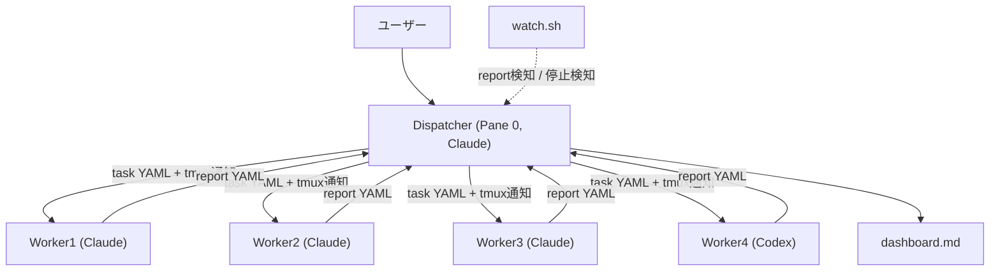

Claude Code 1セッションに実装からレビューまで全部任せていると、セッションが長くなるにつれて過去の指示や設計判断がコンテキストから溢れていく。実装した本人がそのままレビューもするので、バグを見落としても気づきにくい。複数プロジェクトを並行して触っていると、どの指示がどのタスクに対する返事なのか分からなくなる。

こうした問題に対して、tmux 上に「管理者」役の Dispatcher と実作業をする複数の Worker (Claude Code + Codex CLI) を並べ、タスクの受け渡しをファイルベースの YAML で行う環境を作った。リポジトリは https://github.com/h-wata/squad 。

## pane構成

tmux の1 session に役割の違う pane を並べている。

```
Pane 0: Dispatcher (Claude)   タスク分配・進捗管理のみ担当
Pane 1-3: Worker 1-3 (Claude) 実装・調査
Pane 4: Terminal              汎用シェル
Pane 5: Aux-Shell              SSH等の汎用利用
Pane 6: Worker 4 (Codex)       設計相談・cross-review
```



## Dispatcher はコードを書かない

Dispatcher の仕事は、ユーザーの指示をどの Worker にどのプロジェクトのタスクとして振るか判断し、`queue/projects/<project>/tasks/worker{N}.yaml` にタスクを書き、tmux 経由で通知し、`reports/worker{N}_report.yaml` を待って dashboard を更新することだけに絞ってある。実装を Dispatcher にやらせないのは、Dispatcher のコンテキストを「誰に何を振ったか」の管理だけに使いたいからだ。実装の詳細まで持たせると、複数タスクを同時に捌いているうちに割り当て状況そのものを見失う。

タスクと報告はプロジェクトごとにディレクトリを分けている。

```
queue/projects/<project>/
  tasks/worker1.yaml
  tasks/worker2.yaml
  tasks/worker4.yaml     # Codex 向け
  reports/worker1_report.yaml
  reports/worker4_report.yaml
```

複数リポジトリを同時に回しても、タスクファイルの置き場所が分かれているのでどのプロジェクトの指示か迷わない。全体の状況は index の `dashboard.md` から `dashboards/<project>.md` を辿る。

## Codexには設計、実装はClaude

Worker 1-3 は Claude Code、Worker 4 は Codex CLI にしている。役割は固定していて、Issue に設計案を書いて技術的な意見を求めるのは Codex、実際にコードを書くのは Claude、という分担にしている。逆に振ることはない。理由は単純で、Codex の利用枠は Claude より限られているので、実装のような手数がかかる作業に食わせると先に枯渇する。

PR のレビューは書いた本人と逆の agent に回す。Claude が実装した PR は Codex にレビューさせ、Codex 側 (設計提案が実装まで進んだ場合) は Claude がレビューする。同じモデルが書いたコードを同じモデルにレビューさせると、同じ思考の癖で同じ見落としをする。これは実際に、Claude が実装した Tier 1 の PR を Claude 自身の self-report だけで信用して先に merge してしまい、後から Codex レビューで問題が見つかった一件があってから、cross-review の承認が出るまで merge しないルールに変えた。

## verify gate

Worker が「実装できました」と自己申告するだけでは、テストが本当に通っているかは分からない。`verify:` ブロックを持つタスクには、実装した Worker とは別に verifier サブエージェントを立てて、`verify.commands` を worktree 上で実際に実行させ、`acceptance_criteria` と突き合わせて pass / fail / inconclusive を判定させている。fail なら Worker が直して再検証、を最大試行回数まで繰り返し、それでも通らなければ blocked として人間に投げる。completed を名乗れるのは、実装した本人ではなく別のプロセスが verify を通した後だけ、という順序にしてある。

## watch.sh

`watch.sh` は常駐の監視デーモンで、report ファイルの出現を検知して Dispatcher に通知する、承認プロンプトに自動応答する、停止した Worker を検知する、Issue/PR/CI を低頻度に見て回る、merge済みのworktreeを片付ける、といった作業をやっている。

Claude Code の Worker には自動継続モードがないので、確認待ちのプロンプトが出ると誰も気づかないまま止まり続ける。Sonnet系のWorkerは特にこれが起きやすく、3-5分おきに tmux capture-pane で詰まっていないか見る運用を最初はしていたが、watch.sh に検知を任せてからは人間がポーリングする必要がなくなった。discovery 用に、新しく気づいた Issue や気になる点を拾う inbox の役割も兼ねている。

## Dispatcherのコンテキストを節約する

task YAML の執筆やdashboardの表編集は、内容自体は定型的でも分量がかさむ。これをDispatcher本体にやらせると、肝心のルーティング判断より前にコンテキストを使い切ってしまう。

そこで、ルーティングが決まった後のtask YAML執筆は task-yaml-author という専任のサブエージェントに、report受領後のdashboard更新はdashboard-updater(軽量モデル)に、それぞれ委譲している。Dispatcher本体が持つのは「誰に何を振るか」の判断だけで、実際にYAMLやMarkdownを書き込む作業のトークン消費は別のエージェントに切り離した。

## つまずいた点

cross-review を発注するとき、task YAML に古いPRのhead SHAを書いてしまうと、Codex側がその古いコミットを再検証してしまい結果がずれる。今は発注直前に `gh pr view` で取り直すようにしている。

worker が merge や close のような外部に見える操作を行う場面では、task YAML に承認済みである旨を明記しないと止まってしまう。逆に明記が漏れていると、close すべきIssueが放置されたまま完了報告が上がってきたことがあった。今は「Dispatcher承認済、確認不要」と書く運用にしている。

## リポジトリ

https://github.com/h-wata/squad
