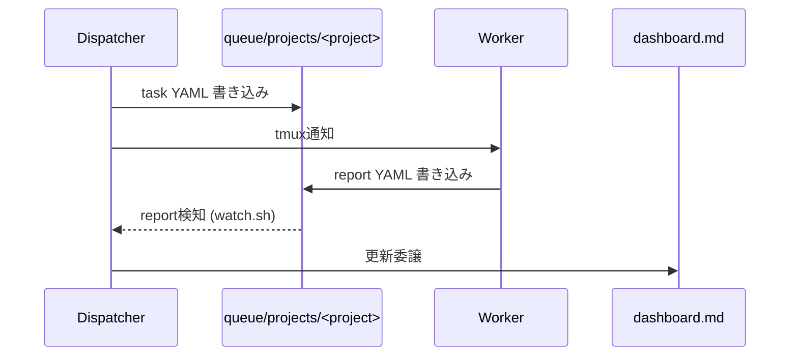

---

title: "tmux + Claude Code + Codex CLIでマルチエージェント開発チームを組んでみた"
emoji: "🤖"
type: "tech" # tech: 技術記事 / idea: アイデア
topics: ["claudecode", "AIエージェント", "tmux", "マルチエージェント"]
published: true

---

:::message
本記事は Claude（AI）の支援を受けて執筆しています。内容は著者がレビュー・編集したうえで公開しています。
:::

Claude Code 1セッションに実装からレビューまで任せる運用をしばらく続けていた。セッションが伸びるほど過去の設計判断がコンテキストから押し出され、実装した本人がそのままレビューもするので同じ見落としを繰り返す。API 連携で複数エージェントを繋ぐ構成も検討したが、各ツールのSDK差異を吸収するレイヤーを自分で保守するコストの方が高いと判断し、tmux の pane とファイルベースの YAML に寄せることにした。壊れても pane を1つ再起動すればいいという単純さを優先した形になる。

これが squad で、tmux 上に「管理者」役の Dispatcher と実作業をする複数の Worker（Claude Code + Codex CLI）を並べ、タスクの受け渡しをYAMLファイルで行う。

@[card](https://github.com/h-wata/squad)

## pane構成

```
Pane 0: Dispatcher (Claude)   タスク分配・進捗管理のみ担当
Pane 1-3: Worker 1-3 (Claude) 実装・調査
Pane 4: Terminal              汎用シェル
Pane 5: Aux-Shell              SSH等の汎用利用
Pane 6: Worker 4 (Codex)       設計相談・cross-review
```

全体の構成はこう。


1タスクが流れる順序はこう。



## Dispatcherはコードを書かない

Dispatcher の役割は、ユーザーの指示をどの Worker のどのプロジェクトのタスクとして振るか判断することに絞ってある。判断が済んだら `queue/projects/<project>/tasks/worker{N}.yaml` にタスクを書いて tmux 経由で通知する。あとは `reports/worker{N}_report.yaml` が届くのを待ち、届いたら dashboard 更新をサブエージェントに委譲する。この3手だけを繰り返す。

実装まで Dispatcher にやらせてしまうと、複数タスクを同時に捌いているうちに「誰にどこまで振ったか」の管理そのものを見失う。実装の詳細はコンテキストに乗せず、割り当て状況の把握だけに使う、という切り分けにしている。

タスクと報告はプロジェクトごとにディレクトリを分けている。

```
queue/projects/<project>/
  tasks/worker1.yaml
  tasks/worker4.yaml     # Codex 向け
  reports/worker1_report.yaml
  reports/worker4_report.yaml
```

これを分けているのは、別プロジェクトの report を Dispatcher が読み違えたり、Worker の作業ディレクトリと発注元のプロジェクトを取り違えたりする事故を避けたいからだ。全体の状況は index の `dashboard.md` から `dashboards/<project>.md` を辿る。

## 実装はClaude、Codexは設計とレビューに温存

Worker 1-3 は Claude Code、Worker 4 は Codex CLI にしている。実装は原則 Claude が担い、Codex は純設計の検討と cross-review に温存する。Codex の利用枠は Claude より早く尽きるため、手数のかかる実装タスクをそちらに回すと先に枯渇してしまうからだ。Dispatcher が明示的に指定すれば例外的に Codex へ実装を振ることもあるが、迷ったときは Claude に振る、というのが既定の判断になっている。

PR のレビューは書いた本人と逆の agent に回す。Claude が実装した PR は Codex にレビューさせ、逆の場合は Claude がレビューする。同じモデルが書いたコードを同じモデルにレビューさせると、同じ思考の癖で同じ箇所を見落としやすい。この cross-review が承認するまで merge しない、という運用ルールも squad には入っている。

## verify gate

Worker が「実装できました」と自己申告するだけでは、テストが本当に通っているかは担保にならない。`verify:` ブロックを持つタスクには、実装した Worker とは別に verifier サブエージェントを立てて `verify.commands` を worktree 上で実行させ、`acceptance_criteria` と突き合わせて pass / fail / inconclusive を判定させる。fail した場合は Worker が修正し、最大試行回数まで再検証を繰り返す。それでも通らなければ blocked として人間の判断に投げる。completed を名乗れるのは、実装した本人ではなく別プロセスの検証を通した後だけ、という順序にしている。

## watch.sh

Claude Code の Worker には自動継続モードがないため、確認待ちのプロンプトが出るとそのまま止まり続ける。人間が張り付いていないと、Worker がいつ止まったのか誰も気づかない。これに対応するために `watch.sh` という常駐の監視デーモンを置き、report ファイルの出現を検知して Dispatcher に通知する役割と、停止した Worker を検知して知らせる役割を持たせている。加えて、承認プロンプトへの自動応答、Issue/PR/CIの低頻度な巡回、merge 済み worktree の後片付けもここでやっている。新しく気づいた Issue や気になる点を拾う inbox としても機能する。

## Dispatcherのコンテキストを節約する

task YAML の執筆や dashboard の表編集は定型的だが分量がかさむ作業で、これを Dispatcher 本体に書かせると、ルーティング判断そのもののためのコンテキストを圧迫する。そこで、ルーティングが決まった後の task YAML 執筆は task-yaml-author という専任のサブエージェントに、report 受領後の dashboard 更新は dashboard-updater（軽量モデル）に、それぞれ切り出した。Dispatcher 本体が保持するのは「誰に何を振るか」の判断だけにして、実際の書き込み作業のトークン消費を分離している。

## リンク

- GitHub: https://github.com/h-wata/squad
