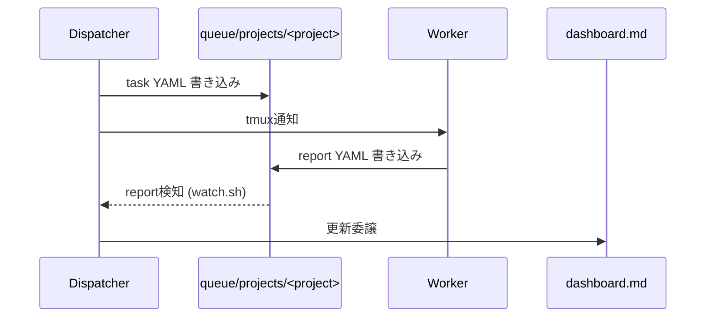

---

title: "tmux + Claude Code + Codex CLIでマルチエージェント開発チームを組んでみた"
emoji: "🤖"
type: "tech" # tech: 技術記事 / idea: アイデア
topics: ["claudecode", "AIエージェント", "tmux", "マルチエージェント"]
published: true

---

:::message
本記事は Claude（AI）の支援を受けて執筆しています。内容は著者がレビュー・編集したうえで公開しています。
:::

Claude Code を使ってコードを書いていると、並列で処理を分担したくなる場面が増えてきます。デザイン・フロントエンド・バックエンドで担当を分けたいとき、独立した複数の Issue を同時に進めたいとき。コードレビューを AI にやらせるなら、できれば実装したのとは別の AI モデルに見てもらったほうが、客観的なレビューになります。

こうなると単独の AI エージェントでは物足りません。確かにサブエージェントを使えばレビューを切り出すことはできます。ですが、たとえば Issue に実装で取り組むとき、①コード実装 → ②レビューへの回答として再実装、という流れだと、サブエージェントは①が終わった時点で一度切れてしまう。②の再実装ではコンテキストを持たないまま一からやり直すことになり、効率的とは言えません。ある程度コンテキストを抱えたまま独立して動くエージェントを複数持つことには、それなりの意味があります。

そこで今回、tmux の pane を複数立ち上げ、それぞれで Claude Code や Codex を動かし、send-keys で各 pane と会話しながら、YAML ファイルでタスクとレポートを共有して共同作業を進める仕組みを作りました。

最初は API で複数エージェントを繋ぐ構成も考えて、やめました。Claude Code と Codex CLI の SDK 差を吸収するレイヤーを自分で書いて保守する手間が、得られるものに見合いません。それより、すでに手元で動いている CLI をそのまま並べたほうが早い。仕組みが単純だと、壊れたときに pane を一個 restart すれば元に戻ります。凝った配管より、これを取りました。

できあがったのが squad です。tmux の上に管理役の Dispatcher を1体置き、その下に実作業をする Worker（Claude Code と Codex CLI）を並べます。エージェント同士は直接おしゃべりせず、やり取りはすべて YAML ファイル越しです。

この手の仕組み自体は、以前から色々な人が取り組んでいます。今回はそこに、いかにトークンを節約しながらタスクを回すか、いかに自律で動き続けさせるか、というノウハウが溜まってきたので共有します。

@[card](https://github.com/h-wata/squad)

## pane構成

pane の並びはこれだけ。

```
Pane 0: Dispatcher (Claude)   タスク分配・進捗管理のみ担当
Pane 1-3: Worker 1-3 (Claude) 実装・調査
Pane 4: Terminal              汎用シェル
Pane 5: Aux-Shell              SSH等の汎用利用
Pane 6: Worker 4 (Codex)       設計相談・cross-review
```

俯瞰するとこうなります。


1本のタスクが流れるときの順番はこう。



## Dispatcherはコードを書かない

Dispatcher にやらせるのは1つだけ。来た指示を、どのプロジェクトの・どの Worker のタスクに落とすかを決めることです。決めたら `queue/projects/<project>/tasks/worker{N}.yaml` を書いて tmux で通知します。あとは `reports/worker{N}_report.yaml` が返ってくるのを待ち、届いたら dashboard の更新はサブエージェントに投げます。この3手をぐるぐる回すだけ。

実装まで Dispatcher に持たせた時期もありましたが、これがよくありませんでした。複数タスクを並行で捌いていると、コードの中身がコンテキストを食って、肝心の「誰にどこまで振ったか」を見失います。だから実装の詳細は一切乗せません。Dispatcher の頭の中は割り当て表だけにしておきます。

タスクと報告はプロジェクトごとにディレクトリを分けます。

```
queue/projects/<project>/
  tasks/worker1.yaml
  tasks/worker4.yaml     # Codex 向け
  reports/worker1_report.yaml
  reports/worker4_report.yaml
```

分けている理由は事故防止に尽きます。混ぜておくと、別プロジェクトの report を Dispatcher が読み違えたり、Worker が作業ディレクトリと発注元の PJ を取り違えたりします。全体を見るときは index の `dashboard.md` から `dashboards/<project>.md` に降りていきます。

## 実装はClaude、Codexは設計とレビューに温存

この配役には理由があります。Codex の利用枠は Claude より先に尽きます。手数のかかる実装を Codex に流すと、肝心なときに枠がなくて動けません。だから実装は基本 Claude（Worker 1-3）に寄せて、Codex（Worker 4）は設計の検討とレビューに温存します。Dispatcher が名指しすれば Codex に実装を振ることもありますが、それは例外で、迷ったら Claude、が既定値です。

レビューの回し方にはもう一段こだわっています。PR は、書いた本人と逆の agent にレビューさせます。Claude が書いた PR は Codex に、Codex が書いた PR は Claude に回します。同じモデルに書かせてレビューまでさせると、同じ癖で同じ穴を見逃す。冒頭で「別のモデルに見てもらったほうが客観的」と書いたのは、これを運用に落とした話です。そして、この cross-review が通るまで PR は merge しません。CI が緑でも、です。

## verify gate

「実装できました」という Worker の自己申告だけでは、テストが本当に通ったのかは分かりません。放っておくと平気で「全部通りました」が返ってきます。

なので、`verify:` ブロックを持つタスクには、実装した Worker とは別に verifier サブエージェントを立てます。verifier が `verify.commands` を worktree で実際に走らせ、`acceptance_criteria` と突き合わせて pass / fail / inconclusive を返します。fail なら Worker が直してもう一度、を上限回数まで。それでも通らなければ blocked にして人間に投げます。completed を名乗れるのは、書いた本人ではなく別プロセスの検証を抜けた後だけ。要は自己採点を禁止しているだけなのですが、これがあるとないとでは報告の当てになり方がまるで違います。

## watch.sh

Claude Code の Worker には自動継続モードがありません。これが地味に効きます。確認待ちのプロンプトが1つ出ると、Worker はそこで黙って止まります。人間が張り付いていない限り、いつ止まったのか誰も気づかないまま時間だけが過ぎていきます。

監視は最初、Claude Code の `/loop` コマンドにやらせてみました。ですが、地味にトークンを食う上に抜け漏れが多く、実用に耐えません。それで専用の監視スクリプトを書きました。

それが `watch.sh` という常駐デーモンです。report ファイルが現れたのを検知して Dispatcher に通知します。止まった Worker を見つけて知らせます。承認プロンプトには自動で応答します。ついでに Issue / PR / CI を低頻度で巡回し、merge 済みの worktree を片付け、こちらが後で拾いたい「気になったこと」を放り込む inbox も兼ねます。Dispatcher がルーティング判断に集中していられるのは、この地味な常駐が裏で全部拾ってくれているからです。

## Dispatcherのコンテキストを節約する

Dispatcher には今回いちばん賢いモデルを割り当てています。ユーザーからの曖昧な指示をきちんと汲んで、タスクに分解する。その一点のためです。裏を返せば、ここで無駄なトークンは使いたくない。Dispatcher のトークンをどう削るかが、全体でいちばん効きます。

コンテキストを食う原因ははっきりしていて、各 Worker との報告・指示のラリーが伸びることと、dashboard や task YAML の生成がかさむことでした。task YAML を書くのも dashboard の表を直すのも、中身は定型なのに行数だけは膨らみます。これを Dispatcher 本体にやらせると、ルーティング判断のために空けておきたいコンテキストが、その文字数で埋まる。もったいない。

対策は2つ。`/compact` を差し込むタイミングを決めておくことと、定型作業を Skill やサブエージェントに切り出すことです。ルーティングが決まった後の task YAML 執筆は task-yaml-author に、report を受けた後の dashboard 更新は dashboard-updater（軽いモデル）に渡します。Dispatcher が自分の頭で抱えるのは「誰に何を振るか」だけ。書き取り仕事のトークンは、別の担当に払わせます。

## リンク

- GitHub: https://github.com/h-wata/squad
